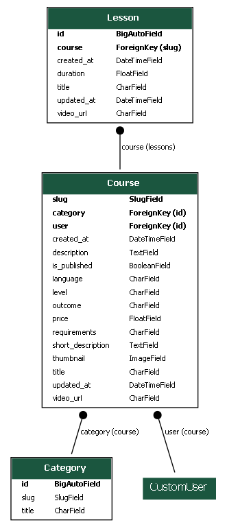
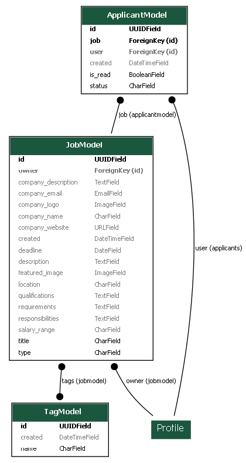
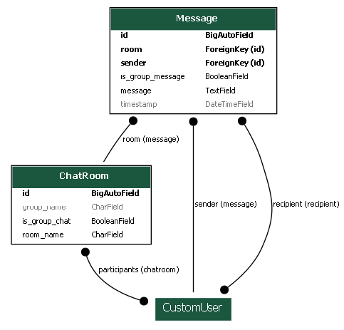

# SeaGro Platform Documentation

## Table of Contents
1. Introduction
2. System Overview
3. Technology Stack
4. Application Architecture 
5. Installation and Setup
6. Security Features

## 1. Introduction

SeaGro is a comprehensive full-stack web platform that integrates multiple services including job searching, learning management, bike sharing, social networking, and task management. The platform is built using Django framework with a modular architecture consisting of twelve distinct applications.

This Website is built as part of a Competition called *Build a Website Challenge* hosted by Avanthi engineering college garividi.
### 1.1 Project Objectives
- Create a centralized platform for multiple user services
- Provide seamless integration between different modules
- Ensure secure user authentication and data management
- Enable real-time communication between users
- Facilitate community building and content sharing

## 2. System Overview

### 2.1 Core Features
- User authentication and profile management
- Job posting and application system
- Online learning platform with course management
- Bike sharing service
- Social networking capabilities
- Task management system
- Real-time chat functionality
- Tech news aggregation

### 2.2 User Roles
- Regular Users
- Employers
- Job Seekers
- Course Instructors
- Bike Share Operators
- System Administrators

## 3. Technology Stack

### 3.1 Backend
- Framework: Django
- Language: Python
- Database: sqllite
- Cache: Redis

### 3.2 Frontend
- HTML5
- CSS3
- JavaScript
- Bootstrap Framework

### 3.3 Development Tools
- Version Control: Git
- Cloud Platform: AWS/Azure
- IDE: VS Code

## 4. Application Architecture

### 4.1 Django Apps Structure and Class Diagrams

#### 4.1.1 Home App
- Primary landing page
- About section
- Contact information
- Navigation to other services

#### 4.1.2 Core App
Functions:
- User authentication (login/logout)
- User registration
- Profile management
- Password management
- Profile picture handling


#### 4.1.3 News App
Features:
- Tech news aggregation
- Article listing
- Detailed article view
- Archive access


#### 4.1.4 Learning Centre App
Components:
- Course catalog
- Course enrollment system
- Learning management
- Progress tracking


#### 4.1.5 Courses App
Features:
- Course categorization
- Detailed course views
- Lesson management
- Course search functionality




#### 4.1.6 Cart App
Functions:
- Shopping cart management
- Course purchase handling
- Checkout process
- Payment integration


#### 4.1.7 Tasks App
Features:
- Project creation and management
- Task assignment
- Priority setting
- Progress tracking
- Collaboration tools


#### 4.1.8 Job Profile App
Components:
- User type selection (employer/employee)
- Profile completion
- Skill management
- Messaging system


#### 4.1.9 Jobs App
Features:
- Job posting
- Job search
- Application management
- Employer dashboard
- Candidate tracking




#### 4.1.10 Bike Share App
Components:
- Station management
- Bike rental system
- Payment processing
- Maintenance reporting
- User balance management


#### 4.1.11 Social Hub App
Features:
- Post creation and management
- User following system
- Content interaction (likes/comments)
- Content reporting
- Notification system


#### 4.1.12 Chat App
Features:
- Real-time messaging
- Group chat creation
- Message history
- User status tracking




## 5. Installation and Setup

### 5.1 Prerequisites
```bash
Python 3.8+
Django 3.2+
Virtual Environment
Git
```

### 5.2 Installation Steps
1. Clone the repository
```bash
git clone <repository-url>
cd seagro
```

2. Create and activate virtual environment
```bash
python -m venv venv
source venv/bin/activate  # Linux/Mac
venv\Scripts\activate     # Windows
```

3. Install dependencies
```bash
pip install -r requirements.txt
```

4. Configure environment variables
```bash
cp .env.example .env
# Update .env with your configurations
```

5. Initialize database
```bash
python manage.py migrate
```

6. Create superuser
```bash
python manage.py createsuperuser
```

7. Run development server
```bash
python manage.py runserver
```


## 6. Security Features

### 6.1 Authentication
- Django's built-in authentication system
- Password hashing
- Session management
- CSRF protection

### 6.2 Authorization
- Role-based access control
- Permission management
- View-level security

### 6.3 Data Protection
- Form validation
- SQL injection prevention
- XSS protection
- Secure file uploads